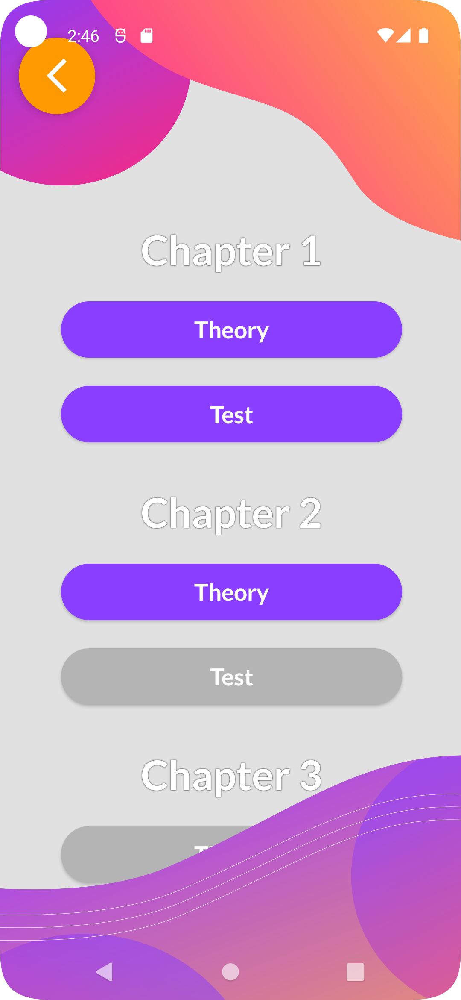
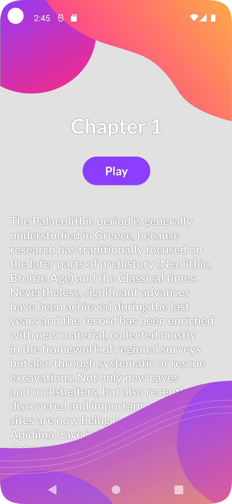
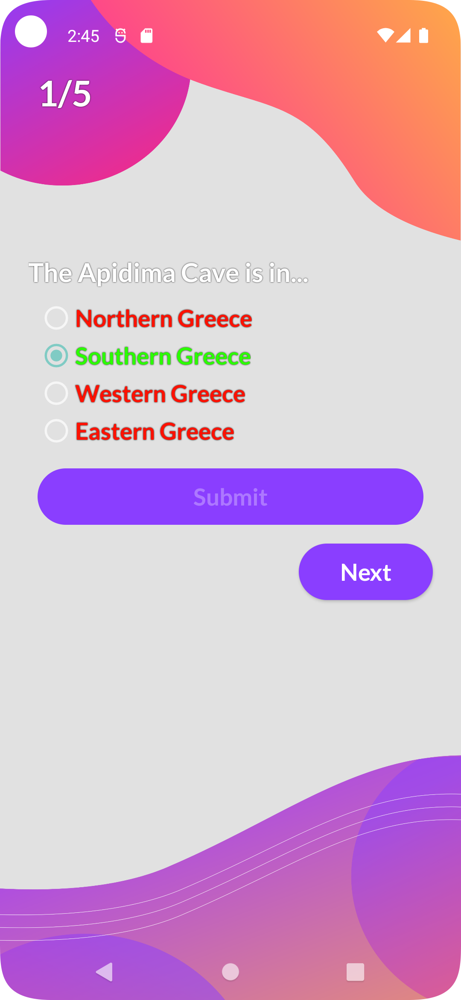

# LearningApp

### A Simple Application made to learn the basics of android development.

A simple application written in Java. It allows you to learn new topics, test your knowledge and keep track of statistics and grades.

## Technology Stack

* Java
* Room (SQLite)
* Android Studio

 
 
 

##  UI

</img>
</img>
</img>
</img>
</img>
</img>
</img> 
